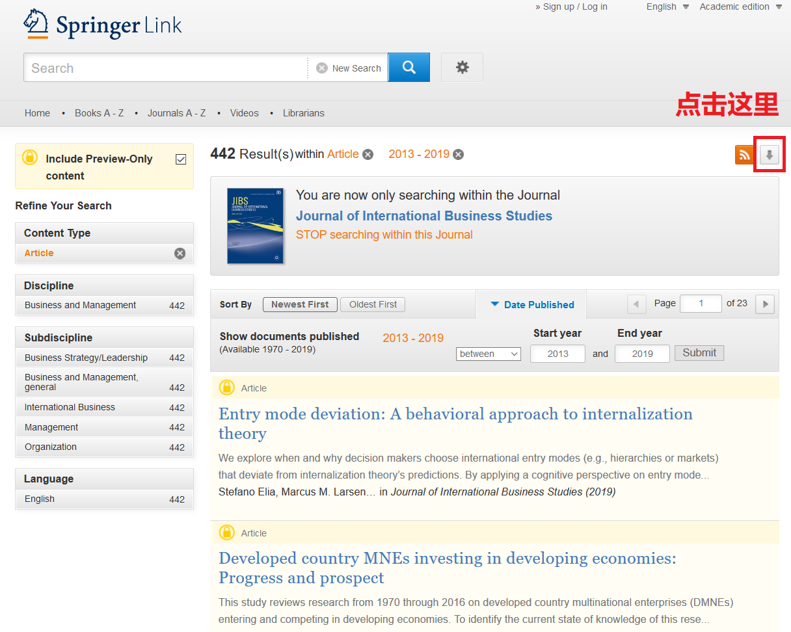

# 用python抓取某期刊最近5年发表的所有文章信息
-------

## 选定期刊

我想要了解国际商务(international business)领域近年来发表的文章，在google中搜索“google scholar journal ranking international business”，点开第一个链接，得到如下页面：


这里以排名第一的Journal of International Business Studies为例，示意如何抓取近年来发表的所有文章的信息。

## 找到文章列表

经过一番搜寻，我找到了自2013年以来发表的全部442篇文章的[列表](https://link.springer.com/search?facet-content-type=Article&facet-journal-id=41267&sortOrder=newestFirst&date-facet-mode=between&facet-start-year=2013&previous-start-year=1970&facet-end-year=2019&previous-end-year=2019):



点击图中红框中的按钮，可以将全部442篇文章的信息导出到CSV文件。


然而，文件中只有每篇文章的篇名(item title)、作者(authors)和链接(URL)，没有关键词(key words)和摘要(abstract)这些重要信息。

接下来，我们用python编写一个循环，打开每一篇文章的链接，抓取关键词和摘要。

## 抓取网页元素

首先，我们定义一个`get_keywords_abstract()`函数，用来抓取给定网页中的相关元素，代码如下：

```python
import requests
from scrapy import Selector

def get_keywords_abstract(url):
    r = requests.get(url) #打开网页
    if r.status_code != 200: #如果网页连接错误，就返回空字符串
        print("Connection error: {}".format(url))
        return "", ""
    selector = Selector(text=r.text) 
    keywords = selector.css('.Keyword::text').extract()
    abstract = selector.css('#Abs1 p::text').extract_first()
    return keywords, abstract

```
值得说明的是，我使用了scrapy库里面的Selector类来解析网页。之所以这么做，是因为与Beautiful Soup、Pyquery等库相比，我比较熟悉scrapy下的css选择器的使用方法。

为了验证以上代码是否正确，我在命令行中执行以下测试代码：
```python
test_url = 'https://link.springer.com/article/10.1057%2Fs41267-019-00235-7'
keywords, abstract = get_keywords_abstract(test_url)
print(keywords)
print(abstract)
```
结果有点出人意表：
```python
>>> print(keywords)
['entry mode\xa0', 'deviation from prediction\xa0', 'internalization theory\xa0', 'bounded rationality\xa0', 'cognitive bias\xa0']
>>> print(abstract)
'We explore when and why decision makers choose international entry modes (e.g., hierarchies or markets) that deviate from internalization theory’s predictions. By applying a cognitive perspective on entry mode decision making, we propose that the performance of prior international activities influences decision makers’ behavior in different ways than assumed in internalization theory. More specifically, due to a'
```
关键词末尾有多余的字符，这个问题不大，可以在后续处理中批量删除。真正的问题在于，摘要不完整。

在浏览器中打开测试网页，点击右键查看源代码，发现摘要中有一些html标签，比如：

```html
...due to a <em class="EmphasisTypeItalic ">representativeness bias</em> , underperforming ... 
```

正是这些html标签，干扰了正常的文本抓取。

为了解决这个问题，我修改了一下`get_keywords_abstract()`函数：

```python
import requests
from scrapy import Selector

def get_keywords_abstract(url):
    r = requests.get(url) #打开网页
    if r.status_code != 200: #如果网页连接错误，就返回空字符串
        print("Connection error: {}".format(url))
        return "", ""
    selector = Selector(text=r.text) 
    keywords = selector.css('.Keyword::text').extract()
    abstracts = selector.css('#Abs1 p::text').extract() #把extract_first()改成extract()，抓取所有的文本片段
    abstract = ''.join(abstracts) #把文本片段连接起来
    return keywords, abstract
```
重跑测试代码，发现问题解决了。

## 导入CSV文件

接下来就要导入CSV文件中的URL列表，循环抓取关键词和摘要了。

导入CSV文件要用到pandas库：
```python
import pandas as pd

articles = pd.read_csv('../data/jibs_articles.csv', sep=',')
type(articles) # <class 'pandas.core.frame.DataFrame'>
articles.shape # (442, 10)
articles.columns # 列名
articles.head() # 打印前5行
```

## For循环

确定一切无误之后，就要开始循环了：
```python
urls = articles['URL']
keywords = pd.Series(index=articles.index)
abstract = pd.Series(index=articles.index)

for i, url in enumerate(urls):
    keywords[i], abstract[i] = get_keywords_abstract(url)
    print("Finish article: {}".format(i)) # 抓完一个网页就报一个数字，等的时候心里好过一些
```
等了20分钟左右，终于抓完了，只有一篇文章的页面打开错误。

## 保存到CSV文件

接下来，我们把关键词和摘要整合到数据表格中，然后保存到CSV文件。

```python
articles['keywords'] = keywords
articles['abstract'] = abstract
articles.columns # 数据表中增加了keywords和abstract两列
articles.to_csv('../data/jibs_keywords_abstract.csv', sep=',', header=True)
```

为了方便下次使用，我们把数据“腌制”起来：
```python
import pickle
with open("../data/articles.pickle", "wb") as f:
    pickle.dump(articles, f)
```

下次，我们再讲基于关键词的研究趋势分析。